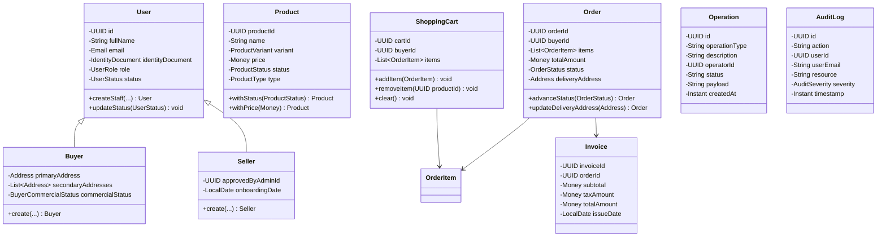

# C4 - Nivel 4: Diagrama de Clases del Dominio

## 1. Diagrama de Clases y Agregados del Dominio
Muestra los modelos principales del dominio, sus Value Objects e interacciones:

```mermaid
classDiagram
    class User {
        -UUID id
        -String fullName
        -Email email
        -IdentityDocument identityDocument
        -UserRole role
        -UserStatus status
        +createStaff(...) User
        +updateStatus(UserStatus) void
    }

    class Buyer {
        -Address primaryAddress
        -List~Address~ secondaryAddresses
        -BuyerCommercialStatus commercialStatus
        +create(...) Buyer
    }

    class Seller {
        -UUID approvedByAdminId
        -LocalDate onboardingDate
        +create(...) Seller
    }

    class Product {
        -UUID productId
        -String name
        -ProductVariant variant
        -Money price
        -ProductStatus status
        -ProductType type
        +withStatus(ProductStatus) Product
        +withPrice(Money) Product
    }

    class ShoppingCart {
        -UUID cartId
        -UUID buyerId
        -List~OrderItem~ items
        +addItem(OrderItem) void
        +removeItem(UUID productId) void
        +clear() void
    }

    class Order {
        -UUID orderId
        -UUID buyerId
        -List~OrderItem~ items
        -Money totalAmount
        -OrderStatus status
        -Address deliveryAddress
        +advanceStatus(OrderStatus) Order
        +updateDeliveryAddress(Address) Order
    }

    class Invoice {
        -UUID invoiceId
        -UUID orderId
        -Money subtotal
        -Money taxAmount
        -Money totalAmount
        -LocalDate issueDate
    }

    class Operation {
        -UUID id
        -String operationType
        -String description
        -UUID operatorId
        -String status
        -String payload
        -Instant createdAt
    }

    class AuditLog {
        -UUID id
        -String action
        -UUID userId
        -String userEmail
        -String resource
        -AuditSeverity severity
        -Instant timestamp
    }

    User <|-- Buyer
    User <|-- Seller
    ShoppingCart --> OrderItem
    Order --> OrderItem
    Order --> Invoice
```
